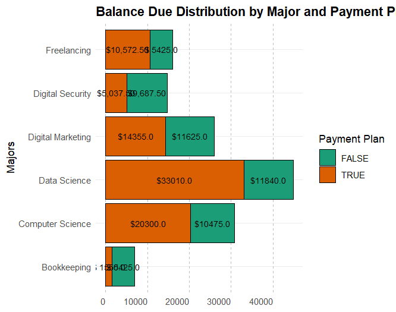
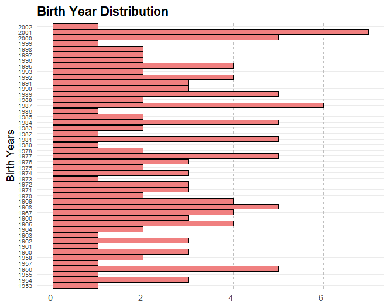
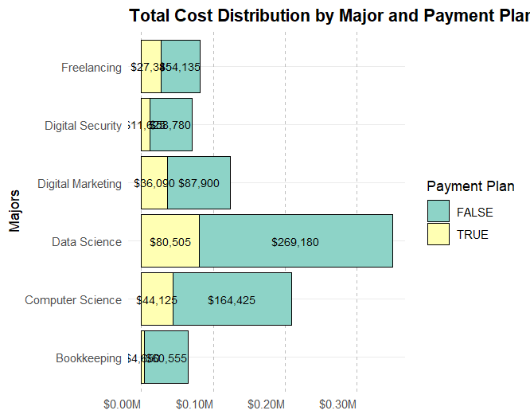

ReadMe for Student Data Images

This is a distribution of balances due from the different majors combined.

This is a chart concerning the birth year of a student.

This chart is a distribution of various majors

This chart shows a distribution of the total cost for different majors selected.

